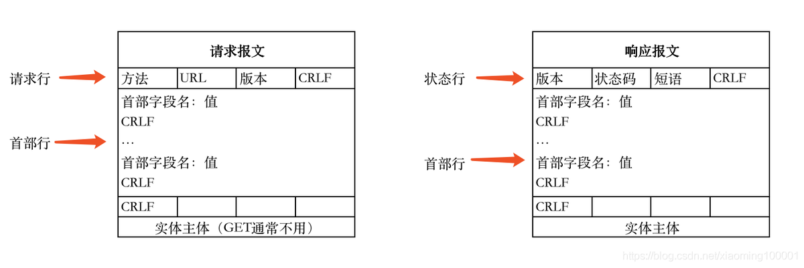
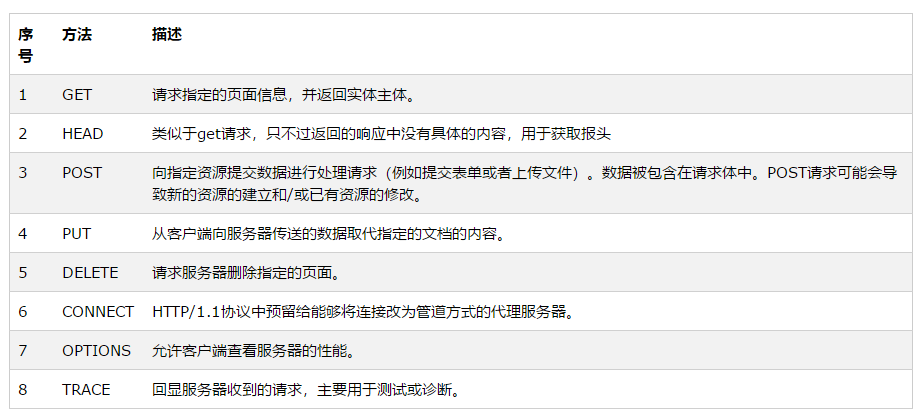

参考博客:
* [HTTP请求的几种类型](https://blog.csdn.net/u012813201/article/details/70210812)
* [HTTP请求方式中8种请求方法（简单介绍)](https://blog.csdn.net/weixin_42981419/article/details/86162244)
## http报文格式(重要)

* http的请求报文由：请求行、**首部**、空行、主体(请求数据)四个部分组成。其中请求行由请求方法字段、URL字段和HTTP协议版本字段3个字段组成，它们用空格分隔

* 一个响应由状态行、响应头部、空行和响应数据4部分组成。


### 请求头和响应头
* [HTTP请求头详解](https://blog.csdn.net/kfanning/article/details/6062118)

首部，消息报头，用来**说明客户端要使用的一些附加信息**

##### 请求头
下面是一些最常见的请求头：    
**Accept：** 浏览器可接受的MIME类型。
>MIME(Multipurpose Internet Mail Extensions)多用途互联网邮件扩展类型。MIME规定了用于表示各种各样的数据类型的符号化方法。 此外，在万维网中使用的HTTP协议中也使用了MIME的框架，标准被扩展为互联网媒体类型。

**Accept - Charset：** 浏览器可接受的字符集。
**Accept - Encoding：** 浏览器能够进行解码的数据编码方式，比如gzip。Servlet能够向支持gzip的浏览器返回经gzip编码的HTML页面。许多情形下这可以减少5到10倍的下载时间。
**Accept - Language：** 浏览器所希望的语言种类，当服务器能够提供一种以上的语言版本时要用到。
**Authorization：** 授权信息，通常出现在对服务器发送的WWW - Authenticate头的应答中。
**Connection：** 表示是否需要持久连接。如果Servlet看到这里的值为“Keep - Alive”，或者看到请求使用的是HTTP 1.1（HTTP 1.1默认进行持久连接），它就可以利用持久连接的优点，当页面包含多个元素时（例如Applet，图片），显著地减少下载所需要的时间。要实现这一点，Servlet需要在应答中发送一个Content - Length头，最简单的实现方法是：先把内容写入ByteArrayOutputStream，然后在正式写出内容之前计算它的大小。
**Content - Length：** 表示请求消息正文的长度。
**Cookie：** 这是最重要的请求头信息之一，参见后面《Cookie处理》一章中的讨论。
**From：** 请求发送者的email地址，由一些特殊的Web客户程序使用，浏览器不会用到它。
**Host：** 初始URL中的主机和端口。
**If - Modified - Since：** 只有当所请求的内容在指定的日期之后又经过修改才返回它，否则返回304“Not Modified”应答。
**Pragma：** 指定“no - cache”值表示服务器必须返回一个刷新后的文档，即使它是代理服务器而且已经有了页面的本地拷贝。
**Referer：** 包含一个URL，用户从该URL代表的页面出发访问当前请求的页面。
**User - Agent：** 浏览器类型，如果Servlet返回的内容与浏览器类型有关则该值非常有用。
**UA - Pixels，UA - Color，UA - OS，UA - CPU：** 由某些版本的IE浏览器所发送的非标准的请求头，表示屏幕大小、颜色深度、操作系统和CPU类型。

>www.baidu.com的GET请求如下所示：
>
>GET / HTTP/1.1
Host: www.baidu.comUser-Agent: Mozilla/5.0 (Windows; U; Windows NT 5.1; en-US; rv:1.7.6)
Gecko/20050225 Firefox/1.0.1
Connection: Keep-Alive
>
>* 请求行
>    * 第一部分说明了该请求是GET请求。
>    * 该行的第二部分是一个斜杠（/），用来说明请求的是该域名的根目录。
>    * 该行的最后一部分说明使用的是HTTP 1.1版本（另一个可选项是1.0）。
>* 第2行是请求的第一个首部，HOST。首部HOST将指出请求的目的地。结合HOST和上一行中的斜杠（/），可以通知服务器请求的是www.baidu.com/（HTTP 1.1才需要使用首部HOST，而原来的1.0版本则不需要使用）。
>* 第3行中包含的是首部User-Agent，服务器端和客户端脚本都能够访问它，它是浏览器类型检测逻辑的重要基础。该信息由你使用的浏览器来定义（在本例中是Firefox 1.0.1），并且在每个请求中将自动发送。
>* 最后一行是首部Connection，通常将浏览器操作设置为Keep-Alive（当然也可以设置为其他值）。
>* 注意，在最后一个首部之后有一个空行。即使不存在请求主体，这个空行也是必需的。
### 请求报文
例子：访问谷歌：www.google.cn/search
```
POST /search HTTP/1.1  
Accept: image/gif, image/x-xbitmap, image/jpeg, image/pjpeg, application/vnd.ms-excel, application/vnd.ms-powerpoint, 
application/msword, application/x-silverlight, application/x-shockwave-flash, */*  
Referer: <a href="http://www.google.cn/">http://www.google.cn/</a>  
Accept-Language: zh-cn  
Accept-Encoding: gzip, deflate  
User-Agent: Mozilla/4.0 (compatible; MSIE 6.0; Windows NT 5.1; SV1; .NET CLR 2.0.50727; TheWorld)  
Host: <a href="http://www.google.cn">www.google.cn</a>  
Connection: Keep-Alive  
Cookie: PREF=ID=80a06da87be9ae3c:U=f7167333e2c3b714:NW=1:TM=1261551909:LM=1261551917:S=ybYcq2wpfefs4V9g; 
NID=31=ojj8d-IygaEtSxLgaJmqSjVhCspkviJrB6omjamNrSm8lZhKy_yMfO2M4QMRKcH1g0iQv9u-2hfBW7bUFwVh7pGaRUb0RnHcJU37y-
FxlRugatx63JLv7CWMD6UB_O_r  
 
hl=zh-CN&source=hp&q=domety
```
### 响应报文
```
HTTP/1.1 200 OK
Date: Fri, 22 May 2009 06:07:21 GMT
Content-Type: text/html; charset=UTF-8
 
<html>
      <head></head> <body> <!--body goes here--> </body> 
</html>
```

## 8种请求方法



HTTP请求的方法：
* HTTP/1.1协议中共定义了八种方法（有时也叫“动作”），来表明Request-URL指定的资源不同的操作方式
* HTTP1.0定义了三种请求方法： GET, POST 和 HEAD方法。
* HTTP1.1新增了五种请求方法：OPTIONS, PUT, DELETE, TRACE 和 CONNECT 方法


###  1. GET
向特定的资源发出请求。注意：GET方法不应当被用于产生“副作用”的操作中，例如在Web Application中，其中一个原因是GET可能会被网络蜘蛛等随意访问。
###  2. HEAD
向服务器索与GET请求相一致的响应，只不过响应体将不会被返回。这一方法可以再不必传输整个响应内容的情况下，就可以获取包含在响应小消息头中的元信息。
 

###  3. POST
向指定资源提交数据进行处理请求（例如提交表单或者上传文件）。数据被包含在请求体中。POST请求可能会导致新的资源的建立和/或已有资源的修改。 

#### get与post区别
POST方式请求行中不包含数据字符串，这些数据保存在”请求内容”部分，各数据之间也是使用”&”符号隔开, POST方式大多用于页面的表单中。

* 1.数据存放位置：
    * **GET**：请求的**数据会附在URL之后**（就是把数据放置在HTTP协议头＜request-line＞中），以?分割URL和传输数据，多个参数用&连接;例如：login.action?name=hyddd&password=idontknow&verify=%E4%BD%A0 %E5%A5%BD。如果数据是英文字母/数字，原样发送，如果是空格，转换为+，如果是中文/其他字符，则直接把字符串用BASE64加密，得出如： %E4%BD%A0%E5%A5%BD，其中％XX中的XX为该符号以16进制表示的ASCII。  

    * **POST**：把提交的**数据放置在是HTTP包的包体**＜request-body＞中。**GET提交的数据会在地址栏中显示出来，而POST提交，地址栏不会改变。**

* 2.传输数据的大小：  
    *  首先声明,**HTTP协议没有对传输的数据大小进行限制**，HTTP协议规范也没有对URL长度进行限制。 而在实际开发中存在的限制主要有：   
    * **GET**: **特定浏览器和服务器对URL长度有限制**，例如IE对URL长度的限制是2083字节(2K+35)。对于其他浏览器，如Netscape、FireFox等，理论上没有长度限制，其限制取决于操作系统的支持。   因此对于GET提交时，传输数据就会受到URL长度的限制。   
    * **POST**: 由于不是通过URL传值，**理论上数据不受限**。但**实际各个WEB服务器会规定对post提交数据大小进行限制**，Apache、IIS6都有各自的配置。
*  3.安全性：    
    *  POST的安全性要比GET的安全性高。
    *  通过GET提交数据，用户名和密码将明文出现在URL上，(1)登录页面有可能被浏览器缓存， (2)其他人查看浏览器的历史纪录。
###  4. PUT
向指定资源位置上传其最新内容
###  5. DELETE
请求服务器删除Request-URL所标识的资源

###  6. CONNECT
HTTP/1.1协议中预留给能够将连接改为管道方式的代理服务器。

### 7. OPTIONS
返回服务器针对特定资源所支持的HTTP请求方法，也可以利用向web服务器发送‘*’的请求来测试服务器的功能性
###  8. TRACE
回显服务器收到的请求，主要用于测试或诊断

## URI&RUL

HTTP使用统一资源标识符（Uniform Resource Identifiers, URI）来传输数据和建立连接。
* URI：Uniform Resource Identifier 统一资源标识符, 是用来标示 一个具体的资源的，我们可以通过 URI 知道一个资源是什么
* URL：Uniform Resource Location 统一资源定位符，是用来定位具体的资源的，标示了一个具体的资源位置。互联网上的每个文件都有一个唯一的URL。
