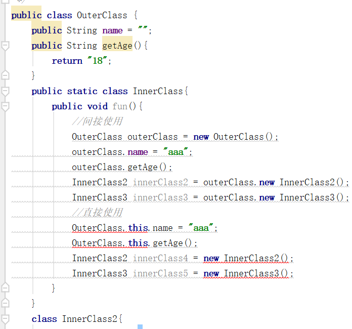
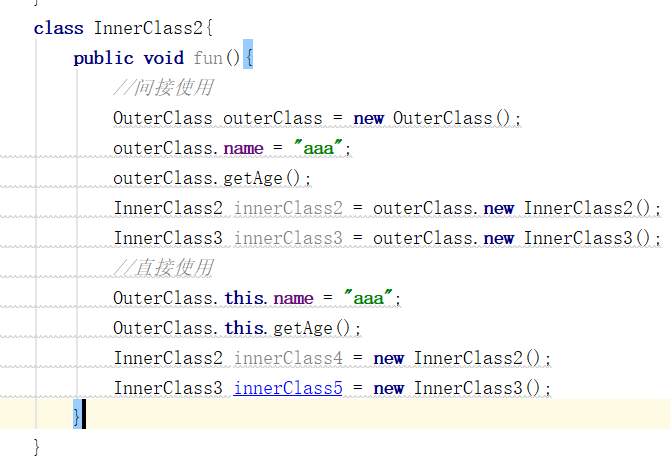

ref:

* [菜鸟教程-java教程](https://www.runoob.com/java)
* 《Java编程思想》【Bruce Eckel著】

## 访问权限修饰符
有些类型只能使用部分访问权限修饰符，并且有默认修饰符
>public, 所有类可见
private, 当前类可见
default（缺省）, 同一包内可见
protected, 同一包内可见，不同包的子孙类可见

## 类的访问权限（不含内部类）
**类只有public,default两种访问形式**
* default类
    *  只能被同一包内的其他类访问。
* public类
    * 也可以被其他包中的类访问。
    * 每个编译单元（文件）都只能有一个public类
    public类名称必须和其所在文件同名

一个编译单元（文件）中可以没又pubic类，但是不太常用
**类不能是private, protected的**
* private构造器：
    * 如果不希望任何人（包括同一个包内）对该类有访问权限，可以把所有的构造器都指定为private，这样只有自身static方法可以创建该类的对象，其他类无法使用构造器。
    * 但是具有该类访问权限的其他包可以调用该类的public/default static成员，因为static成员不需要实例。

## 接口的访问权限（不含内部接口）
* **接口只有public, default两种访问形式**
* 接口是隐式抽象(abstract)的，当声明时不必使用abstract关键字
* 接口中的方法会被隐式的指定为 public abstract（且只能是）
* 接口中的变量会被隐式的指定为 public static final（且只能是）（即类常量）
* 接口中的方法是不能在接口中实现的，只能由实现接口的类来实现接口中的方法
* JDK 1.8 以后，接口里可以有静态方法和方法体了。


## 内部类和内部接口的访问权限（从外部访问）
### 非静态内部类和内部接口
修饰符：
>public, 所有类可见
private, 当前类可见
default, 同一包内可见

**把内部类当成是外部类的一个成员变量来理解**，class本来就是一个类类型，由class关键字定义的类相当于是创建了一个class实例（变量）。

使用方式，需创建外部类/接口的实例：`Outer.Inner inner = new Outer.new Inner();`
### 静态内部类和静态内部接口
就像使用静态方法一样，不需要创建外部类/接口的实例：`Outer.Inner inner = new Outer.Inner();`

**接口中的内部类是隐式public static的**，不能为private
**接口中的内部接口也是隐式public static的**，不能为private
**示例代码中均为接口中的内部类和内部接口**，类中的内部类和内部接口同理。
### 代码示例
文件目录结构：InnerDemo和InnerDemo2属于不同的包
>|-InnerDemo
| |-OuterClass.java
| |-OuterClass2.java
| |-OuterInterface.java
| |-OuterInterface.java
| |-Test.java
|
|-InnerDemo2
| |-Test.java

OuterClass.java：外部类嵌套内部类

```java
public class OuterClass {    
    public class InnerClass{}    
    class InnerClass2{}    
    private class InnerClass3{}
}
```
OuterClass2.java：外部类嵌套内部接口

```java
public class OuterClass2 {   
    public interface InnerInterface{}    
    interface InnerInterface2{}    
    private interface InnerInterface3{}    
    //InnerInterface实现类    
    public class InnerInterfaceImp implements InnerInterface{}    
    class InnerInterfaceImp2 implements InnerInterface{}    
    private class InnerInterfaceImp3 implements InnerInterface{}    
    //InnerInterface2实现类    
    public class InnerInterface2Imp implements InnerInterface2{}   
    class InnerInterface2Imp2 implements InnerInterface2{}    
    private class InnerInterface2Imp3 implements InnerInterface2{}    
    //InnerInterface3实现类    
    public class InnerInterface3Imp implements InnerInterface3{}   
    class InnerInterface3Imp2 implements InnerInterface3{}    
    private class InnerInterface3Imp3 implements InnerInterface3{}
}
```
OuterInterface.java：外部接口嵌套内部类

```java
/*接口中的内部类是隐式public static的，不能为private*/
public interface OuterInterface {    
    public static class InnerClass{}
    //    private class InnerClass3{}//非法
}
```
OuterInterface2.java：外部接口嵌套内部接口

```java
/*接口中的内部类是隐式public static的，不能为private
接口中的内部接口也是隐式public static的，不能为private */
public interface OuterInterface2 {    
    public static interface InnerInterface{}
    //    private interface IninerInterface3{}//非法    
    public static class InnerInterfaceImp implements 
    InnerInterface{}
}
```
InnerDemo/Test.java：测试类
```java
public class Test {    
    public static void main(String[] args) {        
        //外部类嵌套的内部类        
        OuterClass.InnerClass inner = new OuterClass().new InnerClass();        
        OuterClass.InnerClass2 inner2 = new OuterClass().new InnerClass2();        
        OuterClass.InnerClass3 inner3 = new OuterClass().new nnerClass3();//非法
        //外部类嵌套的内部接口       
        OuterClass2.InnerInterface innerInterface = new OuterClass2().new InnerInterfaceImp();        
        OuterClass2.InnerInterface innerInterface_2 = new OuterClass2().new InnerInterfaceImp2();       
        OuterClass2.InnerInterface innerInterface_3 = new OuterClass2().new InnerInterfaceImp3();//非法        
        OuterClass2.InnerInterface2 innerInterface2 = new OuterClass2().new InnerInterface2Imp();        
        OuterClass2.InnerInterface2 innerInterface2_2 = new OuterClass2().new InnerInterface2Imp2();        
        OuterClass2.InnerInterface2 innerInterface2_3 = new OuterClass2().new InnerInterface2Imp3();//非法        
        OuterClass2.InnerInterface3 innerInterface3 = new OuterClass2().new InnerInterface3Imp();//非法        
        OuterClass2.InnerInterface3 innerInterface3_2 = new OuterClass2().new InnerInterface3Imp2();//非法        
        OuterClass2.InnerInterface3 innerInterface3_3 = new OuterClass2().new InnerInterface3Imp3();//非法       
        //外部接口嵌套的内部类        
        OuterInterface.InnerClass innerClass = new OuterInterface.InnerClass();        
        //外部接口嵌套的内部接口        
        OuterInterface2.InnerInterface innerInterface1 = new uterInterface2.InnerInterfaceImp();    
    }
}
```
InnerDemo2/Test.java：测试类，同上，但是包不同，语法识别结果不同
```java
public class Test {    
    public static void main(String[] args) {        
        //外部类嵌套的内部类       
        OuterClass.InnerClass inner = new OuterClass().new InnerClass();       
        OuterClass.InnerClass2 inner2 = new OuterClass().new InnerClass2();        
        OuterClass.InnerClass3 inner3 = new OuterClass().new InnerClass3();//非法        
        //外部类嵌套的内部接口        
        OuterClass2.InnerInterface innerInterface = new OuterClass2().new InnerInterfaceImp();        
        OuterClass2.InnerInterface innerInterface_2 = new OuterClass2().new InnerInterfaceImp2();       
        OuterClass2.InnerInterface innerInterface_3 = new OuterClass2().new InnerInterfaceImp3();//非法        
        OuterClass2.InnerInterface2 innerInterface2 = new OuterClass2().new InnerInterface2Imp();       
        OuterClass2.InnerInterface2 innerInterface2_2 = new OuterClass2().new InnerInterface2Imp2();        
        OuterClass2.InnerInterface2 innerInterface2_3 = new OuterClass2().new InnerInterface2Imp3();//非法        
        OuterClass2.InnerInterface3 innerInterface3 = new OuterClass2().new InnerInterface3Imp();//非法        
        OuterClass2.InnerInterface3 innerInterface3_2 = new OuterClass2().new InnerInterface3Imp2();//非法        
        OuterClass2.InnerInterface3 innerInterface3_3 = new OuterClass2().new InnerInterface3Imp3();//非法        
        //外部接口嵌套的内部类        
        OuterInterface.InnerClass innerClass = new OuterInterface.InnerClass();        
        //外部接口嵌套的内部接口        
        OuterInterface2.InnerInterface innerInterface1 = new OuterInterface2.InnerInterfaceImp();   
    }
}
```
## 外部[类/接口]访问其内部[类/接口]
**都可访问**，即使是private, 因为private是当前类可见，**对于内部类来说，其当前类就是其外部类**
## 内部[类/接口]访问其外部[类/接口]
**对外部类/接口的访问**：创建实例、使用方法、使用变量

### 内部类访问外部类
**类比静态方法**
**静态内部类**：可以创建**外部类实例（其他类也可以创建）**，但是不能直接使用外部类的**变量、方法、其他内部类**，因为它是静态的，**没有外部类实例的引用**，**就像静态方法不能使用非静态变量**一样。


**非静态内部类**：都可以访问



### 内部类访问外部接口
**接口中的内部类是隐式public static的**，不能为private
参考静态内部类访问外部类
### 内部接口访问外部类
需通过内部接口的实现类（可以为内部类）访问外部类
参考内部类访问外部类

### 内部接口访问外部接口
需通过内部接口的实现类访问外部接口
**接口中的内部接口是隐式public static的**，不能为private
参考静态内部类访问外部类

