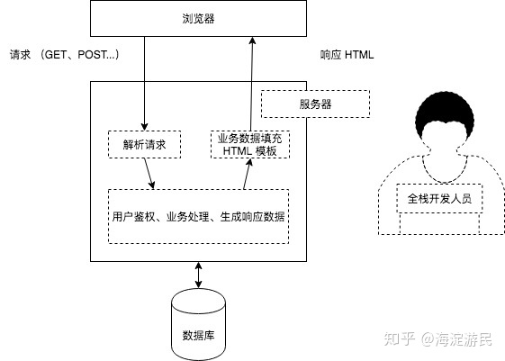
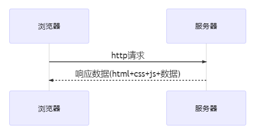
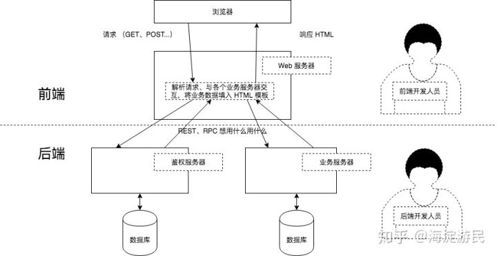
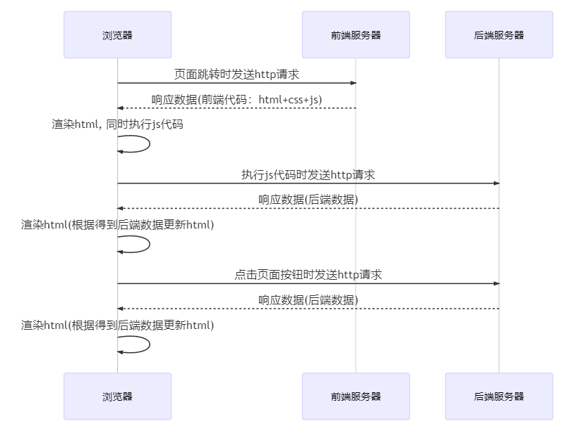

参考：
[到底什么是前后端分离 1](https://www.zhihu.com/answer/547205270)
[到底什么是前后端分离 2](https://www.zhihu.com/answer/557406666)
[到底什么是前后端分离 3](https://www.zhihu.com/answer/542961677)

前后端分离是个**架构设计问题**。所谓架构设计，实际上是如何合理的对现实的人力架构进行系统映射，以便最大限度的提高整个公司的运行效率。

## 前后端的定义

前后端定义，不应该是以语言来定义，而是应该以它的**运行环境**

- Html+CSS+JS，都是**在浏览器端执行，统一称之为前端**。(用户能看到)
- Java，C，Python，PHP 这些**在服务器端运行，统一称之为后端**。(用户看不到）

## 前后端不分离

### 架构设计

### 交互方式

浏览器发请求，服务器端给出一个完整的网页，浏览器再发请求，服务器端再给出一个完整的网页

### 缺点

传输的重复数据比较多，网络又会有延迟。所以有没有办法，只传送必要的数据？这是 Ajax 的起源。

### Ajax

Ajax 就是只传递数据，不传递整个网页。这也是被用来在翻页，注册，发送验证码等场景，但也仅仅止布于此了。

## 前后端分离

### 架构设计

### 交互方式(通过浏览器测试)

- 页面跳转(浏览器地址栏 url 会变)时浏览器先发送请求给前端服务器
- 浏览器得到响应数据前端代码(html+css+js, 响应数据)并渲染。(地址栏输入后端服务器的 url 会直接显示 json 格式数据, 是 html 就会渲染)
- 渲染时会执行 js 代码，这时 js 代码向后端服务器发送请求得到数据并动态更新 html 元素得到最终页面。

### 区分前后端的原因

- 第一个，是可以并行开发。前后端的进度互不影响，在过去，前后端不分离的情况下，前端的工作量相对较少，一个前端可以对四个后端。

- 第二个，是成本问题。在过去，后端的成本还是比前端要高一些。同样的工作，如果能拆给两个人做，一个成本高一点，一个成本低一点，能接受。

- 第三个，CSS 太难了。JS 还好，和后端语言在对技能的训练上相差不大，可是。。CSS 是什么鬼？记住那么多的属性，和 Hash 算法有关系吗？

### 优点

- 前端人员和后端人员只需约定好接口，大大降低了前后端耦合性
- 前端人员彻底不用再关心业务处理是怎么回事，他只需要把界面做好就可以了
- 后端人员也不用再关系前端界面是什么样的，他只需要做好业务逻辑处理即可。
- 服务的切离，代码管理，服务部署也都独立出来分别管理，系统的灵活性也获得了极大的提升。
